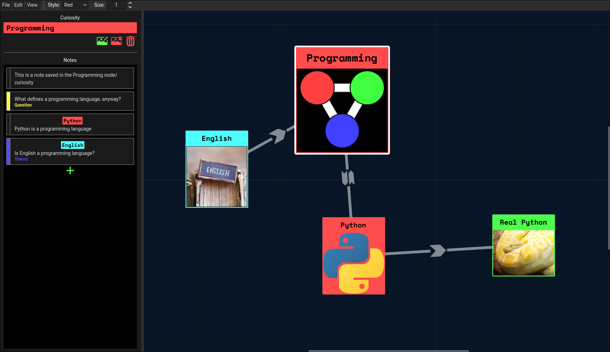

# Rumor Map
A (work-in-progress) tool made in Godot capable of creating rumor maps inspired by the game mechanic in Outer Wilds. This type of map may also be known as a detective board or conspiracy map.

## Why?
I started this project after watching the Apple TV show *Severance*, with a desire to try and piece together its plot and try to theorize about its upcoming seasons (season 2 was the most recent at the time). Motiviation died down for a couple of months, but was revived when part 4 of the [Valle Verde](https://www.youtube.com/@-Alluvium-) YouTube series was released.

# Installation
There is no way to install this yet.

If you are truly dedicated, then you can clone this repo and open it as a Godot project to run it yourself.

# Progress
I'm working on this project by myself and whenever I have free time + motivation. I don't have an ETA on when this will be complete, but a rough roadmap can be found in [TODO.md](TODO.md).

# Contributing
I'm not looking for any contributors at this time. However if you notice a bug or feature that is NOT listed in [TODO.md](TODO.md) then you can create an issue, which I may try to get to. This is a passion project so I cannot guarantee I'll cover everything requested. sorry!
